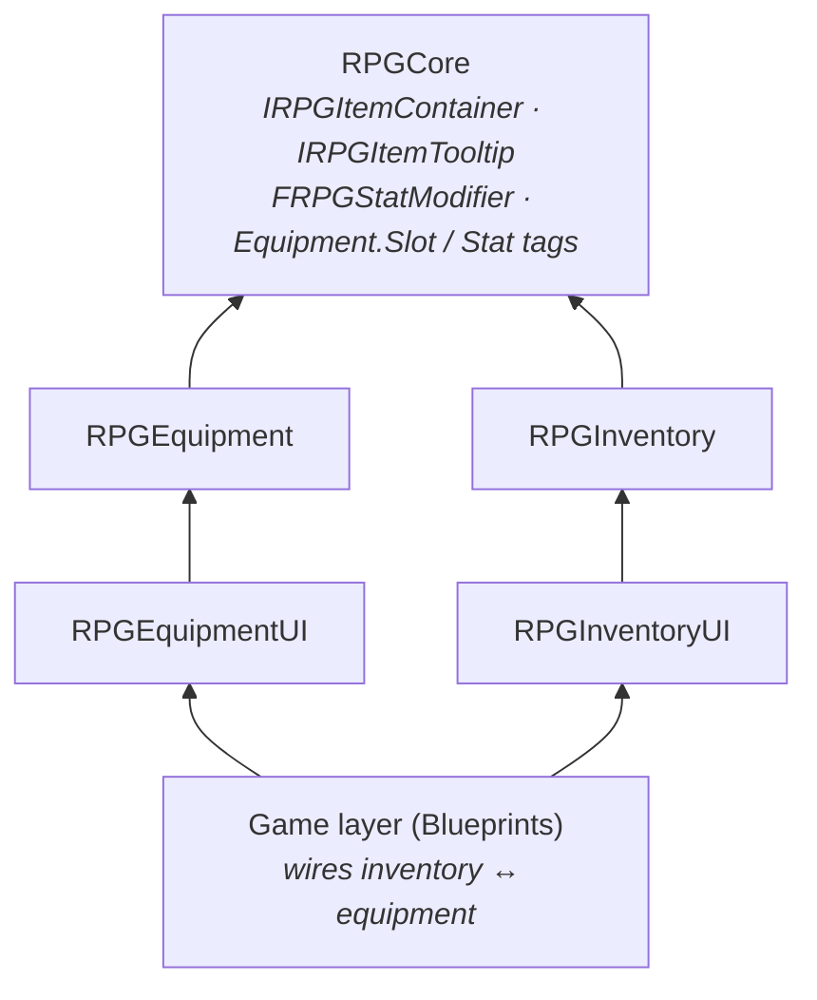
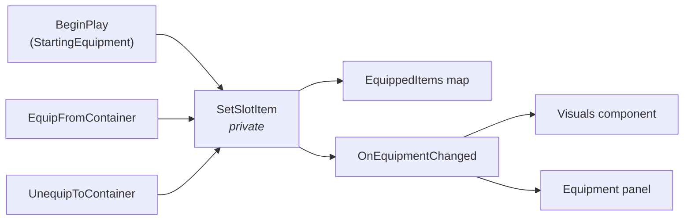
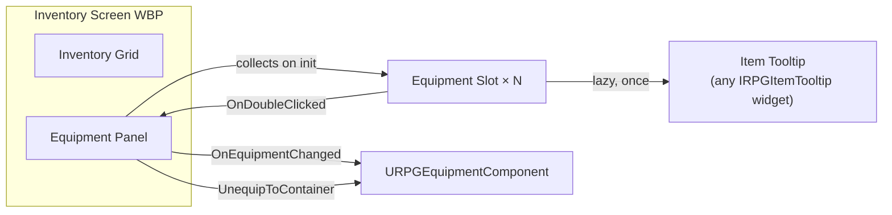

# Equipment System

Slot-based equipment with Gameplay Tag slots, safe transfer to and from any item container, visual attachment to the
character mesh, stat modifiers, and an equipment panel that shares the inventory's tooltip.

| Question | Owner |
|---|---|
| *Can this item be equipped, where, and what does it give?* | **`URPGEquipmentFragment`** on the item definition |
| *What is the character wearing?* | **`URPGEquipmentComponent`** (on the pawn) |
| *What does it look like?* | **`URPGEquipmentVisualsComponent`** (on the pawn) |
| *How does the player see and change it?* | **`RPGEquipmentUI`** widgets |

---

## 1. Modules

```
Plugins/
├── RPGCore/                          Item definition, IRPGItemContainer, IRPGItemTooltip, FRPGStatModifier, slot & stat tags
└── RPGEquipment/
    ├── RPGEquipment   (Runtime)      Equipment fragment, equipment component, visuals component, result enum
    └── RPGEquipmentUI (Runtime)      Equipment slot / panel widgets (UMG)
```

| Module | Depends on | Why |
|---|---|---|
| `RPGEquipment` | `RPGCore`, `GameplayTags` | Reads item data, talks to the inventory only through `IRPGItemContainer` |
| `RPGEquipmentUI` | `RPGEquipment`, `RPGCore`, `UMG`, `GameplayTags` (+ private `Slate`, `SlateCore`, `InputCore`) | Displays equipment state |

**`RPGEquipment` has no dependency on `RPGInventory`**, and `RPGEquipmentUI` has none on `RPGInventoryUI`.
Equipment works with any actor component that implements `IRPGItemContainer` (the inventory, a chest, a merchant),
and the inventory compiles and works without the Equipment plugin.



---

## 2. Data

### Tags (`RPGCoreTags`)

| Tag | Use |
|---|---|
| `Equipment.Slot.MainHand`, `OffHand`, `Head`, `Chest`, `Hands`, `Legs`, `Feet` | Equipment slots |
| `Stat.Damage`, `Stat.Armor` | Stats that modifiers can change |

New slots (rings, amulet, back) and new stats are added as Gameplay Tags; no code changes are needed.

### `FRPGStatModifier` (RPGCore)

| Field | Description |
|---|---|
| `Stat` | Gameplay Tag, filtered to `Stat.*` in the editor |
| `Value` | Flat amount added to the stat |

It lives in RPGCore so that later systems (GAS abilities, buffs, progression) can produce and consume the same type.

### `URPGEquipmentFragment`

Added to an `URPGItemDefinition` to make it equippable. It appears as **Equipment** in the fragment picker.

| Property | Description |
|---|---|
| `EquipSlot` | Slot tag the item goes into (picker filtered to `Equipment.Slot.*`) |
| `AttachedStaticMesh` | Soft reference, for rigid items (swords, shields, helmets) |
| `AttachedSkeletalMesh` | Soft reference, for items that deform with the body (armour, gloves) |
| `AttachSocket` | Socket on the character mesh (e.g. `weapon_r`); used for static meshes |
| `Modifiers` | `TArray<FRPGStatModifier>`; the array shows each entry by its stat name |

`URPGEquipmentFragment::GetEquipSlot(Item)` returns an empty tag for items without the fragment.
An item with no mesh is still valid: it changes stats but is not drawn.

---

## 3. `URPGEquipmentComponent`

Lives on the pawn and holds one item per slot.

### Settings

| Property | Default | Description |
|---|---|---|
| `AvailableSlots` | The 7 default slot tags | Slots this character has. A pet or a ghost could have fewer |
| `StartingEquipment` | — | Items equipped on `BeginPlay` (not taken from the inventory) |

`BeginPlay` logs a warning (`LogRPGEquipment`) if `AvailableSlots` is empty, then equips the starting items.

### API

| Function | Description |
|---|---|
| `GetEquippedItem(Slot)` | Item in the slot, or `nullptr` |
| `IsSlotEmpty(Slot)`, `HasSlot(Slot)` | State queries (`HasSlot` uses an exact tag match) |
| `CanEquip(Item)` / `FindSlotForItem(Item)` | Picks the first matching **empty** slot, otherwise the first matching **occupied** one (a swap) |
| `EquipFromContainer(Item)` | Moves one unit from the owner's item container into its slot, swapping the old item back into the container |
| `UnequipToContainer(Slot)` | Moves the slot's item back into the owner's item container |
| `GetStatModifier(Stat)` | Sum of all equipped modifiers for one stat |
| `GetAllStatModifiers()` | `TMap<Stat, Value>` for every stat any equipped item modifies |

`EquipFromContainer` returns an **`ERPGEquipResult`**, so callers (UI, AI, game code) can react to the reason:

| Result | Meaning |
|---|---|
| `Success` | The item is equipped |
| `NoValidSlot` | The item has no equipment fragment, or the character has no matching slot |
| `NoContainer` | The owner has no `IRPGItemContainer` |
| `ItemNotInContainer` | The container does not hold the item |
| `ContainerFull` | The previously equipped item could not be put back; nothing changed |

### Events

| Delegate | When |
|---|---|
| `OnEquipmentChanged(Slot, NewItem, OldItem)` | Every time a slot's content changes. `NewItem == nullptr` means unequipped |

### Single gate



`SetSlotItem` is the **only** function that writes to `EquippedItems`, and the only one that broadcasts. A slot can
never change without listeners being told, and no caller can put an item into a slot without going through the
container.

### Transfer safety

Items are never lost or duplicated, even when the container is full:

| Operation | Order |
|---|---|
| `EquipFromContainer` | Remove the new item from the container **first** (this frees space), then put the old item back. If the old item does not fit, the new item is returned to the container (**rollback**) and the call returns `ContainerFull`. A failed rollback triggers an `ensure`, because it would mean an item was lost |
| `UnequipToContainer` | Add the item to the container **first**; clear the slot only if the add succeeded |

### Stats: pull, not push

Stats are **computed on request** from the equipped items. There is no cached total that could get out of sync.
With at most a handful of slots this is cheap, and it means equipment never needs to know who reads the stats.

---

## 4. `URPGEquipmentVisualsComponent`

Lives on the pawn and listens to `OnEquipmentChanged`. Gameplay never talks to it.

| Property | Description |
|---|---|
| `TargetMeshTag` | Component tag of the character mesh to attach to (default `EquipmentTarget`). If no component has the tag, the first skeletal mesh component is used |

| Item has | Visual |
|---|---|
| `AttachedStaticMesh` | A static mesh component attached to `AttachSocket` |
| `AttachedSkeletalMesh` | A skeletal mesh component that follows the body through **Leader Pose** (`SetLeaderPoseComponent`) |
| Neither | Nothing is drawn |

- Visual components are created at runtime (`NewObject` → `SetupAttachment` → `RegisterComponent`), with
  **no collision**, so equipment never blocks the interaction trace or the camera.
- On `BeginPlay` the component **syncs** with what is already equipped (e.g. `StartingEquipment`), so the order in
  which components begin play does not matter.
- On `EndPlay` it unbinds and destroys every visual it created.

---

## 5. UI (`RPGEquipmentUI`)



| Class | Required widgets | Optional widgets | Designer hooks / settings |
|---|---|---|---|
| `URPGEquipmentSlotWidget` | `IconImage` | — | `SlotTag` (per instance), `ItemTooltipClass`, `BP_OnSlotUpdated(bIsEmpty)` |
| `URPGEquipmentPanelWidget` | — | `StatsText` | `SetEquipment(Component)` |

### Behaviour

| Feature | How |
|---|---|
| **Slots** | Placed by hand in the panel WBP, each with its own `SlotTag`. The panel finds them on initialisation, so any layout works (paper doll, list, two columns) |
| **Refresh** | Any `OnEquipmentChanged` refreshes every slot and the stats text |
| **Stats** | One line per stat, using the last part of the tag: `Damage: 15` |
| **Unequip** | Double-click a filled slot |
| **Tooltip** | Same tooltip as the inventory; hidden on empty slots |

### Shared tooltip: `IRPGItemTooltip`

The inventory tooltip widget lives in `RPGInventoryUI`, which the equipment UI must not depend on.
The contract therefore lives in RPGCore:

```cpp
UFUNCTION(BlueprintNativeEvent, BlueprintCallable)
void SetTooltipItem(const URPGItemDefinition* Item, int32 Quantity);
```

- `URPGItemTooltipWidget` (inventory) implements it.
- The equipment slot only knows `TSubclassOf<UUserWidget>` with `meta = (MustImplement = "/Script/RPGCore.RPGItemTooltip")`,
  so the editor lists only valid tooltip widgets, and calls it through `IRPGItemTooltip::Execute_SetTooltipItem`.
- A game can replace the tooltip with any widget that implements the interface, in C++ or Blueprint.

### Equipping from the inventory: game-layer wiring

The inventory UI does not know that equipment exists. Double-clicking an inventory slot broadcasts
**`OnEntryActivated(Entry)`** on the inventory screen; the game decides what "activate" means.
The template wires it in `WBP_InventoryScreen`:

```
Event On Initialized
  → Bind Event to On Entry Activated
      → Get Owning Player Pawn → Get Component by Class (RPGEquipmentComponent)
      → Equip From Container (Entry.Item)

  → Bind Event to On Visibility Changed
      → (if shown) Get Owning Player Pawn → Get Component by Class (RPGEquipmentComponent)
      → Equipment Panel → Set Equipment
```

Binding on every open picks up the current pawn, so respawning or possessing another character just works.
Later, the same `OnEntryActivated` can drink a potion or read a book without changing the inventory plugin.

---

## 6. Setup

### Give a character equipment
1. Add **`RPG Equipment`** to the pawn. Adjust `AvailableSlots` if needed and fill `StartingEquipment`.
2. Add **`RPG Equipment Visuals`** to the pawn. Either tag the character mesh `EquipmentTarget` or leave it untagged
   to use the first skeletal mesh.
3. Add the sockets your items use (e.g. `weapon_r` on the hand bone) to the character's skeleton.
4. The pawn needs an item container (e.g. **`RPG Inventory`**) for equip / unequip to move items.

### Create an equippable item
1. Create an `RPGItemDefinition` data asset as usual (keep `MaxStackSize = 1` for equipment).
2. Add an **Equipment** fragment: `EquipSlot`, a static **or** skeletal mesh, `AttachSocket`, `Modifiers`.

### Equipment panel
1. Create `WBP_EquipmentSlot` from `RPGEquipmentSlotWidget`:
   `SizeBox` (fixed size) → `Overlay` → `Background` (Border, **Visible** so it receives clicks) + `IconImage`.
   Set `Item Tooltip Class` to your tooltip WBP and colour the background in `BP_OnSlotUpdated`.
2. Create `WBP_EquipmentPanel` from `RPGEquipmentPanelWidget`, place one `WBP_EquipmentSlot` per slot and set each
   instance's **Slot Tag**. Use **Auto** size for the slots so their `SizeBox` is respected. Optionally add `StatsText`.
3. Add the panel to `WBP_InventoryScreen` (marked *Is Variable*) and add the wiring from section 5.

---

## 7. Design Decisions

| Decision | Reason |
|---|---|
| Slots are Gameplay Tags, not an enum | New slots are data; per-character slot sets (`AvailableSlots`) come for free |
| Equipment talks to `IRPGItemContainer`, not the inventory class | No plugin dependency; works with chests, merchants or a future stash |
| Remove-first swap with rollback | Swapping works even when the inventory is full, and a failure leaves everything unchanged |
| Private `SetSlotItem` as the single gate | State and events can never disagree |
| Separate visuals component | Gameplay state and presentation are independent; a server or an AI-only pawn can skip visuals |
| Stats are pulled, not cached | No synchronisation bugs; the future GAS integration reads the same API |
| `ERPGEquipResult` instead of `bool` | The caller knows *why* an equip failed and can show the right message |
| Activation event instead of "equip" in the inventory UI | The inventory UI stays reusable; the game decides what activating an item does |
| Tooltip contract in RPGCore | Two UI modules share a widget without depending on each other |

---

## 8. Known Limitations / Next Steps

- No data validation yet: stackable equipment, a missing `AttachSocket`, or a socket that does not exist on the
  skeleton are not reported (planned: `IsDataValid` on the fragment and a socket-exists warning in the visuals component).
- No two-handed weapons or slot blocking (e.g. a two-hander occupying `OffHand`).
- Stats are only calculated, not applied; the Abilities & Stats (GAS) system will consume `GetAllStatModifiers`.
- Meshes are loaded synchronously the first time an item is equipped.
- The stats text is not sorted; line order follows the map.
- No drag & drop between inventory and equipment; equipping is by double-click.
- Not replicated (single-player). Equipped items are marked `SaveGame` for the Save / Load system.
