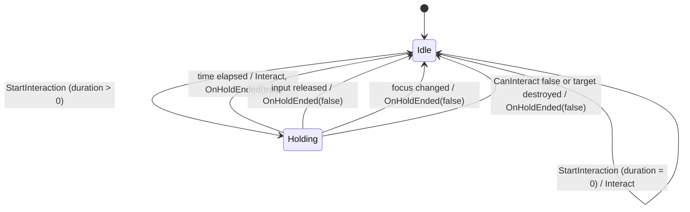
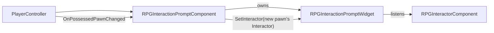

# Interaction System

The Interaction system answers three questions, each owned by a different class:

| Question | Owner |
|---|---|
| *What is the player looking at?* | **Detector** (strategy object) |
| *What is focused, and when do we interact?* | **`URPGInteractorComponent`** (on the pawn) |
| *What happens when we interact?* | **`URPGInteractableComponent`** + the actor's own logic |

Everything else (highlight, prompt UI, debug drawing) is an **observer** that listens to the Interactor and
can be added or removed without touching the core.

---

## 1. Modules

```
Plugins/
├── RPGCore/                         IRPGInteractable, shared gameplay tags
└── RPGInteraction/
    ├── RPGInteraction   (Runtime)   Interactor, Interactable, Detectors, Highlighter, debug CVar
    └── RPGInteractionUI (Runtime)   Prompt component + prompt widget base class (UMG)
```

| Module | Depends on | Why |
|---|---|---|
| `RPGInteraction` | `RPGCore` | Implements the `IRPGInteractable` contract |
| `RPGInteractionUI` | `RPGInteraction`, `RPGCore`, `UMG` | Displays Interactor state |

The core module has **no UMG dependency**. A dedicated server, or a game that ships its own UI, can ignore
`RPGInteractionUI` entirely.

---

## 2. Core Classes

### `IRPGInteractable` (RPGCore)

The contract every interactable fulfils. Blueprint-implementable, so it is always called through `Execute_`.

| Function | Meaning |
|---|---|
| `CanInteract(Instigator)` | Can this object be interacted with right now? |
| `GetInteractionPrompt(Instigator)` | Text shown in the UI (`FText`, localizable) |
| `GetInteractionDuration()` | `0` = instant, `> 0` = hold duration in seconds |
| `Interact(Instigator)` | Perform the interaction |

> **Rule:** check with `Implements<URPGInteractable>()`, call with `IRPGInteractable::Execute_Xxx(Obj, ...)`.
> `Cast<IRPGInteractable>` returns `nullptr` for interfaces implemented in Blueprint.

### `URPGInteractableComponent`

Ready-made implementation of the interface. Add it to any actor to make it interactable.

| Property | Description |
|---|---|
| `InteractionPrompt` | Prompt text, e.g. "Open Chest" |
| `HoldDuration` | Seconds to hold; `0` = instant |
| `bEnabled` | Read-only in Blueprint; change it through `SetInteractionEnabled()` |
| `bSingleUse` | Disables itself after the first successful interaction |
| `HighlightStyle` | `Default`, `Quest`, `Danger`, or `Unhighlight` (no outline) |
| `OnInteracted` | Delegate the owning actor binds to |

`SetInteractionEnabled()` is the single entry point for changing `bEnabled`, so any future side effect
(sound, VFX) only has to be added in one place.

### `URPGInteractorComponent`

Lives on the player pawn. Owns focus tracking and the hold-to-interact state machine.

| Member | Description |
|---|---|
| `Detector` | Instanced strategy object chosen in the editor |
| `ScanInterval` | Scan frequency (default `0.1 s`) — a timer, not Tick |
| `StartInteraction()` / `StopInteraction()` | Bound to input `Started` / `Completed` |
| `GetFocusedInteractable()`, `IsHolding()`, `GetHoldProgress()` | Read-only state for UI and other systems |
| `OnFocusChanged(New, Old)` | Fired only when focus actually changes |
| `OnHoldStarted(Target, Duration)` / `OnHoldEnded(Target, bCompleted)` | Hold lifecycle |
| `GetFocusPrompt()` / `OnPromptChanged(NewPrompt)` | Cached prompt of the focus; re-read every scan and broadcast only when the text changes (e.g. `Pick up Arrow x12` → `Inventory Full`) |

**Hold state machine**



- `bIsHolding` is written in exactly two places (`StartHold`, `EndHold`); every exit goes through `EndHold`.
- Tick is enabled **only while holding**.
- `EndHold` clears state **before** broadcasting, so listeners may safely start a new interaction from the event.
- Only locally controlled pawns scan; AI pawns cost nothing.

### Detectors

`URPGInteractionDetector` is an abstract, `EditInlineNew` strategy. The Interactor passes an
`FRPGInteractionQuery` struct and receives the best interactable (an actor **or** a component implementing
the interface).

`FRPGInteractionQuery` carries `InstigatorActor`, `ViewLocation`, `ViewRotation`, `QueryInterval` and
`CurrentFocus`. New inputs are added as struct fields, so detector signatures never change.

#### Trace Detector — aim-based

| Property | Default | Description |
|---|---|---|
| `TraceChannel` | — | Set to `Interaction` |
| `TraceDistance` | 800 cm | Sweep length from the camera |
| `SphereRadius` | 15 cm | Sweep thickness; forgiving on small objects |
| `MaxReachFromInstigator` | 250 cm | Hit must also be this close to the **character** (third-person camera fix) |

#### Overlap Detector — proximity-based

1. Overlap sphere around the character.
2. **Filters** (hard reject): not interactable, outside the facing cone.
3. **Score** (ranking), each term normalized to 0–1:
   `Score = DistanceWeight · (1 − dist / radius) + AngleWeight · angleScore (+ CurrentFocusBonus)`
4. Sort by score; the first candidate with **line of sight** from the character's eyes wins
   (usually only one line trace per scan).

| Property | Default | Description |
|---|---|---|
| `OverlapChannel` | — | Set to `Interaction` |
| `SearchRadius` | 200 cm | Search sphere |
| `MaxAngle` | 70° | Half-angle of the facing cone (character forward, flattened to 2D) |
| `DistanceWeight` / `AngleWeight` | 1 / 1 | Tune proximity vs. facing |
| `CurrentFocusBonus` | 0.15 | Hysteresis: prevents flicker between equally good candidates |
| `bRequireLineOfSight` | true | Rejects objects behind walls |
| `LineOfSightChannel` | Visibility | Channel used for the line-of-sight trace |

**Writing a new detector:** subclass `URPGInteractionDetector`, override `FindBestInteractable`,
and use the protected `ResolveInteractable(HitActor, Instigator)` helper. It appears in the Interactor's
dropdown automatically.

---

## 3. Observers

### `URPGHighlighterComponent` (on the pawn)

Listens to `OnFocusChanged` and toggles Custom Depth + stencil on the focused actor's meshes.

- Meshes with the component tag **`Highlight`** are outlined; if none are tagged, all primitives are.
- Style comes from the interactable's `HighlightStyle`, or the highlighter's `DefaultStyle` for actors that
  implement the interface directly. The stencil value equals the enum value.
- The highlighter remembers exactly which components it enabled (weak pointers) and disables only those.
- Removing the component disables highlighting entirely.

**Outline material:** `M_InteractionOutline` (post process) samples the stencil of the 8 neighbouring pixels through
`MF_SampleStencilOffset`. A pixel becomes outline when it is empty but a neighbour is not; the neighbour's
stencil selects the colour. `MI_InteractionOutline` exposes `Thickness`, `DefaultColor`, `QuestColor` and `DangerColor`.

### Prompt UI (`RPGInteractionUI`)



- **`URPGInteractionPromptComponent`** lives on the **PlayerController**, so the UI survives death and respawn.
  It creates the widget for the local player only and rebinds it whenever the possessed pawn changes.
- **`URPGInteractionPromptWidget`** (abstract C++ base) holds the logic; designers create a Widget Blueprint from it.
  - `PromptText` (`BindWidget`, required), `HoldProgressBar` (`BindWidgetOptional`)
  - Positioned every frame by projecting the focused actor's bounds top to the screen
  - Hidden with render opacity when off-screen (a collapsed widget would stop ticking and never come back)
  - Designer hooks: `BP_OnPromptShown`, `BP_OnPromptHidden`, `BP_OnHoldEnded(bCompleted)`
- Events (`OnFocusChanged`, `OnPromptChanged`, `OnHold*`) are **pushed** by delegates; hold progress is **pulled**
  each frame with `GetHoldProgress()`. The widget reads the prompt text only from the Interactor, never from the
  interactable directly.
- `SetPromptSuppressed(bool)` on the prompt component hides the prompt (e.g. while a menu is open) and re-syncs with
  the current focus when released.

---

## 4. Collision Setup

| Item | Setting | Reason |
|---|---|---|
| `Interaction` trace channel | Default response **Block** | World geometry stops the trace: no interacting through walls |
| `Interactable` preset | Blocks `Interaction` | One-click setup for interactable meshes |
| `Trigger` preset | `Interaction` = **Ignore** | Invisible volumes must not block interaction |

The channel is always selected in the editor; code never references `ECC_GameTraceChannelN` directly,
so the plugin can move to another project.

---

## 5. Debugging

```
rpg.Interaction.Debug 1
```

| Visual | Meaning |
|---|---|
| Red line | Trace hit nothing |
| Yellow line + sphere | Hit something that was rejected (too far, not interactable, `CanInteract` false) |
| Green line + sphere | Accepted — this is the focus |
| Cyan circle | `MaxReachFromInstigator` around the character |
| On-screen text | Current focus and hold progress |

Shapes live for one scan interval, so they don't flicker. All debug code is compiled out of Shipping builds
(`ENABLE_DRAW_DEBUG`). Press **F8** during Play-In-Editor to eject the camera and inspect the trace from the side.

---

## 6. Recipes

**Door that toggles its prompt ("Open" / "Close")**
Implement `RPGInteractable` directly on the door Blueprint and return the text based on its state in
`GetInteractionPrompt`. No component needed.

**Locked chest that unlocks with a key**
Start with `bEnabled = false`; when the key is obtained call `SetInteractionEnabled(true)`. The chest stops being
focusable, highlighted and prompted automatically while disabled.

**Pickup that disappears**
In `OnInteracted`, add the item to the instigator and `Destroy` the actor. Focus, highlight and prompt clean up
on the next scan.

**Different UI look**
Create a new Widget Blueprint derived from `RPGInteractionPromptWidget`, keep the `PromptText` name, and select it
in the PlayerController's prompt component.
