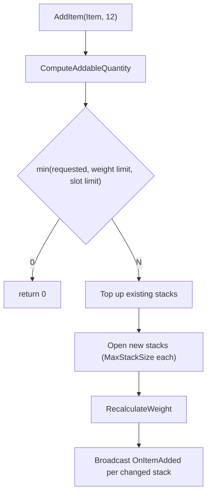
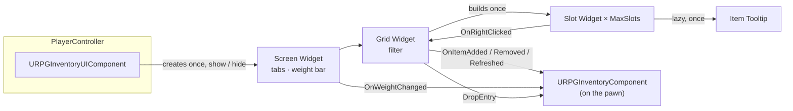

# Inventory System

A slot- and weight-limited inventory with stacking, world pickups, dropping, and a grid UI with tabs,
tooltips and a weight bar. The logic is **list-based**; the grid exists only in the UI.

| Question | Owner |
|---|---|
| *What is an item?* | **`URPGItemDefinition`** (RPGCore) + **`URPGInventoryFragment`** |
| *What does the character carry?* | **`URPGInventoryComponent`** (on the pawn) |
| *How does an item exist in the world?* | **`ARPGItemPickup`** |
| *How does the player see it?* | **`RPGInventoryUI`** widgets + **`URPGInventoryUIComponent`** (on the PlayerController) |

---

## 1. Modules

```
Plugins/
├── RPGCore/                         Item definition, fragment base, IRPGItemContainer, IRPGInteractable
└── RPGInventory/
    ├── RPGInventory   (Runtime)     Inventory component, inventory fragment, item pickup, entry types
    └── RPGInventoryUI (Runtime)     Slot / grid / screen / tooltip widgets, inventory UI component (UMG)
```

| Module | Depends on | Why |
|---|---|---|
| `RPGInventory` | `RPGCore`, `GameplayTags` | Implements `IRPGItemContainer` and `IRPGInteractable` |
| `RPGInventoryUI` | `RPGInventory`, `RPGCore`, `UMG`, `GameplayTags` (+ private `Slate`, `SlateCore`, `InputCore`) | Displays inventory state |

`RPGInventory` has **no dependency on `RPGInteraction`**. The pickup implements the `IRPGInteractable` contract
from RPGCore, so the inventory compiles and works even if the Interaction plugin is removed.

---

## 2. Data

### `URPGItemDefinition` (RPGCore)

A Primary Data Asset: `DisplayName`, `Description`, `Icon`, `ItemType` (Gameplay Tag), `Rarity`, `ItemTags`,
`MaxStackSize` and a list of **fragments**. Systems attach their own data to items through fragments, so RPGCore
never needs to know about inventory, equipment or crafting.

### `URPGInventoryFragment`

| Property | Description |
|---|---|
| `Weight` | Weight of **one** unit, in kg |
| `bCanBeDropped` | Quest items and similar can be marked as non-droppable |
| `WorldMesh` | Soft reference to the mesh shown when the item lies in the world |

`URPGInventoryFragment::GetUnitWeight(Item)` returns `0` for items without the fragment.

### `FRPGItemEntry`

One stack in the inventory.

| Field | Description |
|---|---|
| `EntryId` | `FGuid`. A stable identity that survives sorting, filtering and removal of other entries |
| `Item` | The item definition |
| `Quantity` | Units in this stack (`1 … MaxStackSize`) |

All three fields are marked `SaveGame`. UI and gameplay code refer to stacks by **`EntryId`**, never by array index.

---

## 3. `URPGInventoryComponent`

Lives on the pawn. Implements `IRPGItemContainer`, so other systems (pickups, loot, crafting, merchants) talk to it
through `URPGCoreStatics::FindItemContainer` without knowing the concrete class.

### Settings

| Property | Default | Description |
|---|---|---|
| `MaxSlots` | 30 | Number of stacks the inventory can hold |
| `bUseWeight` | true | One click to switch the whole weight system off |
| `MaxWeight` | 100 kg | Carry limit (only when `bUseWeight`) |
| `bAllowOverweight` | false | If true, items are always accepted and the UI shows the overweight state |
| `StartingItems` | — | Items added on `BeginPlay` |
| `PickupClass` | — | Pickup Blueprint spawned by `DropEntry` |
| `DropDistance` | 100 cm | How far in front of the owner dropped items appear |

### API

| Function | Description |
|---|---|
| `GetItemCount(Item)` | Total units of an item across all stacks |
| `CanAddItem(Item, Quantity)` | True only if **all** units fit |
| `AddItem(Item, Quantity)` | Adds as many as fit; returns the amount actually added |
| `RemoveItem(Item, Quantity)` | Removes across stacks (newest first); returns the amount removed |
| `GetEntries()` / `FindEntry(Id)` | Read access for UI and other systems |
| `RemoveEntry(Id, Quantity)` | Removes from one specific stack |
| `DropEntry(Id, Quantity)` | Spawns a pickup in front of the owner, then removes the items |
| `GetUsedSlots()`, `GetCurrentWeight()`, `IsOverweight()` | State queries |

### Events

| Delegate | When |
|---|---|
| `OnItemAdded(Entry, AddedQuantity)` | Once per stack that received items |
| `OnItemRemoved(Entry, RemovedQuantity)` | Once per stack that lost items |
| `OnWeightChanged(NewWeight, MaxWeight)` | Only when the weight actually changes |
| `OnInventoryRefreshed` | Bulk changes (starting items, later: loading a save) |

### How adding works



- **One source of truth for limits:** `CanAddItem` and `AddItem` both use `ComputeAddableQuantity`, so they can
  never disagree.
- **Partial adds are normal:** 12 arrows with room for 10 → 10 are added, `AddItem` returns `10`.
- **State first, then broadcast:** changes are recorded during the mutation and broadcast afterwards, so listeners
  always see a consistent inventory and may safely modify it again.
- **Starting items are silent:** `BeginPlay` suppresses per-item events and broadcasts a single
  `OnInventoryRefreshed`. Items that don't fit are logged as a warning (`LogRPGInventory`).

### Dropping

`DropEntry` **spawns first and removes second**. If spawning fails (no `PickupClass`, no world), nothing is removed
and the player loses nothing. The pickup is spawned with `SpawnActorDeferred` so `Item` and `Quantity` are set
before `OnConstruction` runs and picks the world mesh.

Items without an inventory fragment, or with `bCanBeDropped = false`, cannot be dropped.

---

## 4. `ARPGItemPickup`

An actor implementing `IRPGInteractable`.

| Property | Description |
|---|---|
| `Item`, `Quantity` | `ExposeOnSpawn`, so they appear as pins on *Spawn Actor from Class* |
| `Mesh` | Root static mesh; its mesh is taken from the fragment's `WorldMesh` in `OnConstruction` (editor preview) |

| Interaction | Behaviour |
|---|---|
| `CanInteract` | Item is set and `Quantity > 0` |
| `GetInteractionPrompt` | `Pick up Arrow`, `Pick up Arrow x12`, or **`Inventory Full`** when not even one unit fits |
| `Interact` | Adds to the instigator's item container; the remainder stays in the world; destroyed at 0 |

The prompt updates **live** while the player keeps looking at the pickup (see Interaction: `OnPromptChanged`).

---

## 5. UI (`RPGInventoryUI`)



All widgets are abstract C++ bases; designers build the look in Widget Blueprints derived from them.

| Class | Required widgets | Optional widgets | Designer hooks |
|---|---|---|---|
| `URPGInventorySlotWidget` | `IconImage` | `QuantityText` | `BP_OnSlotUpdated(bIsEmpty)`, `BP_OnHoverChanged(bHovered)` |
| `URPGInventoryGridWidget` | `SlotGrid` (Uniform Grid Panel) | — | — |
| `URPGInventoryScreenWidget` | `InventoryGrid` | `WeightBar`, `WeightText` | `BP_OnOpened`, `BP_OnClosed`, `BP_OnFilterChanged(Tag)` |
| `URPGItemTooltipWidget` | `NameText` | `DescriptionText`, `WeightText` | `BP_OnItemSet(Item)` (e.g. rarity colour) |

Optional widgets may be left out of the WBP; the code checks for them and simply skips that feature.

### Behaviour

| Feature | How |
|---|---|
| **Grid** | Slot widgets are created once (`MaxSlots`) and reused; any inventory event triggers a full refresh (cheap for ~30 slots, and never out of sync) |
| **Stack count** | Shown only when `Quantity > 1` |
| **Right-click** | Drops 1 unit; **Shift + right-click** drops the whole stack |
| **Tabs** | `SetFilter(Tag)` on the screen; the grid shows only entries whose `ItemType` matches the tag **hierarchically** (`Item.Type.Weapon` also shows `Item.Type.Weapon.Sword`). Empty tag = all |
| **Weight bar** | Fill = current / max; `OverweightColor` when over the limit; hidden when `bUseWeight` is off |
| **Tooltip** | Name, description and total stack weight; lines with no data are hidden |

Because slots store the **`EntryId`**, right-click drop is correct in filtered views where slot index ≠ entry index.

### `URPGInventoryUIComponent`

Lives on the **PlayerController**, so the UI survives death and respawn.

| Member | Description |
|---|---|
| `ScreenWidgetClass` | Your screen WBP |
| `ToggleInventory()` / `OpenInventory()` / `CloseInventory()` / `IsInventoryOpen()` | |
| `OnInventoryToggled(bIsOpen)` | For game-layer reactions (hide prompts, pause, sounds) |

Opening shows the mouse cursor, switches to *Game and UI* input and ignores look / move input. Possession changes
rebind the screen to the new pawn's inventory; if the new pawn has none, the screen closes.

---

## 6. Setup

### Give a character an inventory
1. Add **`RPG Inventory`** to the pawn. Set `MaxSlots`, weight settings and `StartingItems`.
2. Set **`Pickup Class`** to your pickup Blueprint if items can be dropped.

### Create an item
1. *Content Browser → Miscellaneous → Data Asset → `RPGItemDefinition`*.
2. Fill `DisplayName`, `Description`, `Icon`, `ItemType`, `MaxStackSize`.
3. Add an **`RPG Inventory Fragment`**: `Weight`, `WorldMesh`, `bCanBeDropped`.

### Place an item in the world
1. Create `BP_ItemPickup` from `RPGItemPickup`; give its mesh the **`Interactable`** collision preset.
2. Drop it in the level, choose `Item` and `Quantity`. The mesh updates immediately in the editor.

### Inventory screen
1. Create `WBP_InventorySlot`, `WBP_InventoryGrid`, `WBP_InventoryScreen`, `WBP_ItemTooltip` from the C++ bases
   (widget names must match the table above).
2. Slot WBP: give the root a fixed size (`SizeBox`) and make the background **Visible** so it receives clicks;
   set `Item Tooltip Class`.
3. Grid WBP: set `Slot Widget Class` and `Columns`.
4. Add **`RPG Inventory UI`** to the PlayerController and set `Screen Widget Class`.
5. Map an input action (e.g. `I`) in the **PlayerController** to `Toggle Inventory`.

### Recommended game-layer wiring (PlayerController Blueprint)
```
On Inventory Toggled (bIsOpen)
  → RPG Interaction Prompt → Set Prompt Suppressed (bIsOpen)
  → Controlled Pawn → bIsOpen ? Disable Input : Enable Input
```
This hides world prompts and blocks interaction while the menu is open, without either plugin depending on the
other.

---

## 7. Design Decisions

| Decision | Reason |
|---|---|
| List-based logic, grid only in UI | Simpler rules; the same data can be shown as a grid, a list or a merchant view |
| `FGuid` per stack | UI and future save / network code can reference a stack independently of its index |
| Weight lives in a fragment | Items without inventory data (e.g. abilities, quest flags) carry no weight field |
| Struct entries, not UObjects | Cheap to copy, trivially serialisable with `SaveGame` |
| Filter lives in the grid | Viewing state is a UI concern; two screens can filter the same inventory differently |
| Pickup implements the interface directly | Keeps `RPGInventory` independent of `RPGInteraction` |

---

## 8. Known Limitations / Next Steps

- No asset data validation yet (planned: missing icon, `MaxStackSize < 1`, droppable item without `WorldMesh`).
- `WorldMesh` is loaded synchronously; large meshes may hitch the first time they are dropped.
- `DropEntry` uses the owner's location — the component assumes it sits on an actor placed in the world (a pawn).
- No drag & drop, sorting or splitting stacks yet.
- Not replicated (single-player).
- Starting items will need to be skipped when an inventory is restored from a save (Save / Load system).
