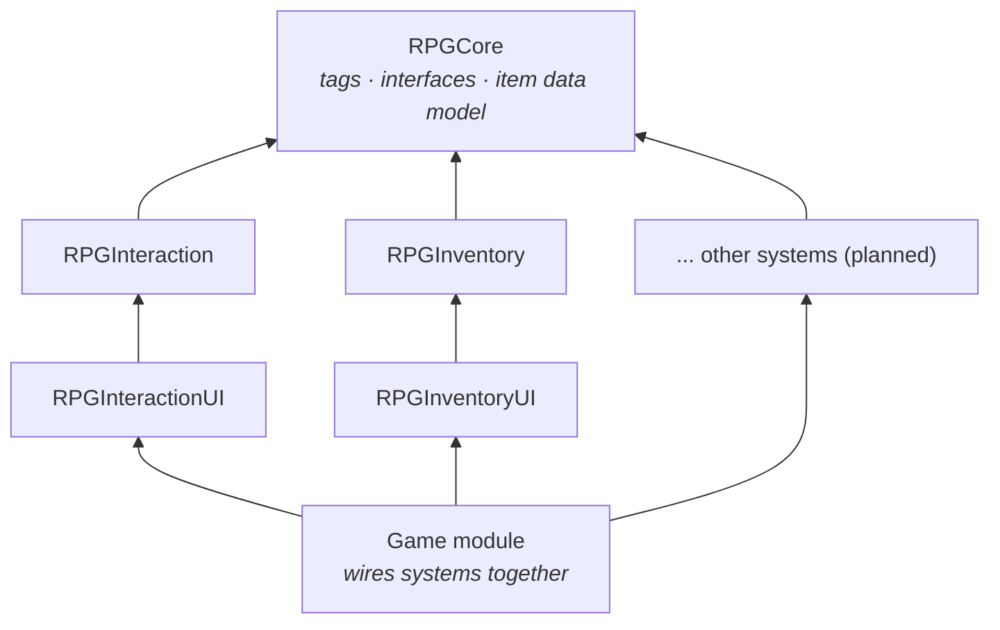
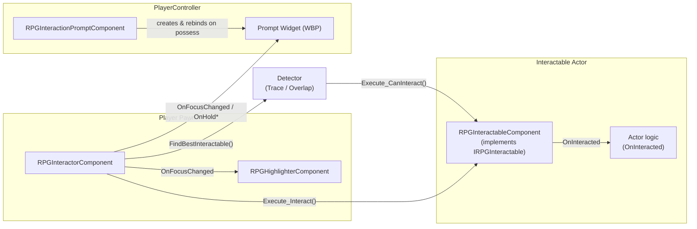

# RPG Template (Unreal Engine 5)

A modular, data-driven RPG framework for Unreal Engine 5, written in C++ with Blueprint-friendly extension points.

Every gameplay system lives in its own plugin and talks to the others only through a small shared core
(Gameplay Tags, interfaces and delegates). Systems can be enabled, disabled or replaced independently,
and designers build content (interactables, items, styles, UI) in the editor without touching C++.

> **Status:** Work in progress. Core, Interaction and Inventory are complete; the remaining systems are planned below.

---

## Systems

| System | Plugin | Status |
|---|---|---|
| Core (tags, interfaces, item data model) | `RPGCore` | ✅ |
| **Interaction** (focus, hold-to-interact, highlight, prompt UI) | `RPGInteraction` | ✅ |
| **Inventory** (stacking, weight, pickups, drop, grid UI with tabs & tooltips) | `RPGInventory` | ✅ |
| Equipment | `RPGEquipment` | ⏳ |
| Abilities & Stats (GAS) | `RPGAbilities` | ⏳ |
| Progression (XP, level, skill tree) | `RPGProgression` | ⏳ |
| Loot & Rarity | `RPGLoot` | ⏳ |
| Crafting | `RPGCrafting` | ⏳ |
| Market / Economy | `RPGEconomy` | ⏳ |
| Faction & Reputation | `RPGFaction` | ⏳ |
| Dialogue (+ graph editor) | `RPGDialogue` | ⏳ |
| Save / Load | `RPGSave` | ⏳ |

---

## Architecture



**Rules the codebase follows**

- **System plugins depend only on `RPGCore`** (and engine modules), never on each other.
  The rule is enforced by the compiler: a system cannot `#include` another system because it is not in its `Build.cs`.
- **Cross-system communication** goes through interfaces (`IRPGInteractable`, `IRPGItemContainer`, ...),
  delegates and Gameplay Tags defined in `RPGCore`.
- **Runtime logic and UI are separate modules.** Core gameplay modules never depend on UMG, so a dedicated
  server or a game with its own UI can drop the UI module.
- **Data over code.** Designer-facing values are properties, Data Assets or Gameplay Tags; collision channels,
  styles and widget classes are chosen in the editor, never hard-coded.
- **No needless ticking.** Components are event-driven or timer-driven; tick is enabled only while it is needed.

---

## Interaction System

A complete, extensible interaction framework: the player focuses on an object, the object is highlighted,
a world-anchored prompt appears, and interacting can be instant or hold-to-interact with a progress bar.

📖 **Full documentation:** [`docs/systems/Interaction.md`](docs/systems/Interaction.md)

### Features

- **Two focus strategies, switchable from a dropdown:**
  - *Trace Detector* — camera-centered sphere sweep (first-person / aim-based games)
  - *Overlap Detector* — scores nearby objects by distance and facing angle, with line-of-sight check and
    focus hysteresis (third-person action RPGs)
- **Instant or hold-to-interact** with progress, cancel on release / focus loss / object disabled or destroyed
- **Single-use and toggleable** interactables
- **Stencil-based outline highlight** with per-object styles (`Default`, `Quest`, `Danger`, or none) and per-mesh selection via component tags
- **World-anchored prompt UI** that follows the object, survives pawn respawn / possession changes, and is fully re-skinnable in UMG
- **Debug visualization** via the `rpg.Interaction.Debug 1` console variable
- Works with **Blueprint-only** interactables (interface implemented in Blueprint) as well as the provided component

### How it fits together



Nobody knows the concrete type of anybody else: the Interactor only knows the `IRPGInteractable` contract,
the Interactable only broadcasts `OnInteracted`, and the highlighter and prompt only listen to the Interactor's delegates.

### Quick start: make a character able to interact

1. **Pawn** → add **`RPG Interactor`** component
   - *Detector:* `Trace Detector` (first-person) or `Overlap Detector` (third-person)
   - Set the detector's channel (`Trace Channel` / `Overlap Channel`) to **`Interaction`**
2. **Input** → create `IA_Interact` (bool) and map it (e.g. `E`). In the pawn:
   - `Started` → `Start Interaction`
   - `Completed` → `Stop Interaction`
3. *(Optional)* **Highlight** → add **`RPG Highlighter`** to the pawn, enable
   *Project Settings → Rendering → Custom Depth-Stencil Pass = Enabled with Stencil*,
   and add `MI_InteractionOutline` to an unbound Post Process Volume.
4. *(Optional)* **Prompt UI** → add **`RPG Interaction Prompt`** to your **PlayerController** and set
   *Prompt Widget Class* to `WBP_InteractionPrompt` (or your own widget derived from `RPGInteractionPromptWidget`).

### Quick start: make an object interactable

1. Give its mesh the **`Interactable`** collision preset.
2. Add **`RPG Interactable`** component and set *Interaction Prompt*, *Hold Duration*, *Single Use*, *Highlight Style*.
3. In the Event Graph, bind **`On Interacted`** and write what should happen.

No C++ required. Custom behaviour (e.g. a prompt that changes between "Open" / "Close") can implement the
`RPGInteractable` interface directly on the actor instead.

---

## Inventory System

A slot- and weight-limited inventory with stacking, world pickups, dropping, and a Witcher-style grid UI.
The logic is list-based; the grid exists only in the UI.

📖 **Full documentation:** [`docs/systems/Inventory.md`](docs/systems/Inventory.md)

### Features

- **Stacking** with per-item `MaxStackSize`, partial adds ("10 of 12 arrows fit")
- **Slot limit + optional weight limit** (one checkbox to turn weight off, optional overweight mode)
- **Data-driven items:** `RPGItemDefinition` data assets + an inventory fragment (weight, world mesh, droppable)
- **World pickups** that show a live prompt (`Pick up Arrow x12` / `Inventory Full`) and keep the remainder
- **Dropping** that can never lose items (spawn first, then remove)
- **Grid UI:** reusable slots, stack counts, hover highlight, tooltips, weight bar,
  **right-click drop / Shift = whole stack**, and **category tabs** driven by hierarchical Gameplay Tags
- **No coupling to Interaction:** the pickup implements the RPGCore interface; the game layer wires
  "hide prompts while the menu is open"

### Quick start

1. **Pawn** → add **`RPG Inventory`** (slots, weight, starting items, `Pickup Class`).
2. **Item** → Data Asset of `RPGItemDefinition` + **`RPG Inventory Fragment`** (weight, world mesh).
3. **World** → `BP_ItemPickup` (from `RPGItemPickup`) with the `Interactable` collision preset; set `Item` / `Quantity`.
4. **UI** → Widget Blueprints from the four `RPGInventoryUI` bases, then **`RPG Inventory UI`** on the
   PlayerController and an input action → `Toggle Inventory`.

---

## Project Setup

- **Engine:** Unreal Engine 5
- **IDE:** JetBrains Rider
- **Source control:** Git + Git LFS (`.uasset`, `.umap`, source art)

```bash
git clone https://github.com/eren-pekdemir/RPGTemplate.git
cd RPGTemplate
git lfs pull
```

Right-click `RPGTemplate.uproject` → *Generate project files*, build the `RPGTemplateEditor` target, and open the project.
The sandbox map `L_Sandbox` contains test interactables for every feature.

---

## Author

**Eren Pekdemir** — Computer Engineering student, Riga Technical University
